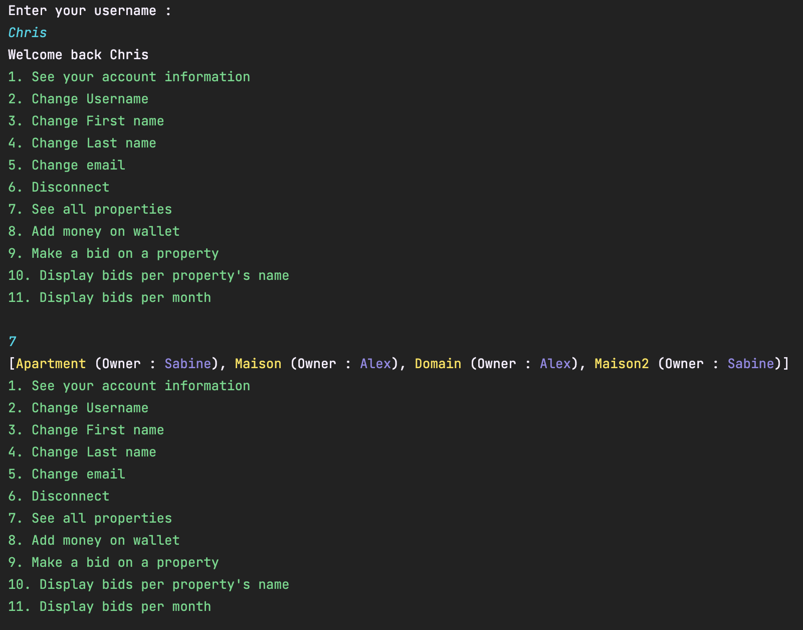

<h1 align="center">Welcome to Rent Property Bid 👋</h1>

> Property rental management application. Owners put houses, apartments or estates up for rent and tenants bid on one or more properties of their choice. At the end, the owner of the property chooses the tenant who made the highest bid

## Author

👤 **Enzo Mourany**

* Website: enzomourany.com
* Github: [@enzo-mourany](https://github.com/enzo-mourany)

## Show your support

Give a ⭐️ if this project helped you!

***
_This README was generated with ❤️ by [readme-md-generator](https://github.com/kefranabg/readme-md-generator)_
